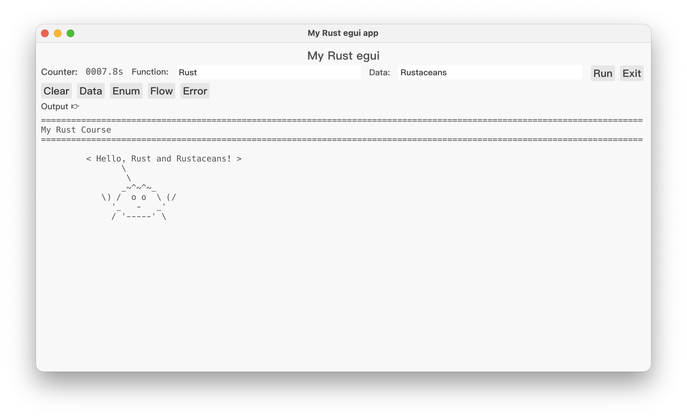
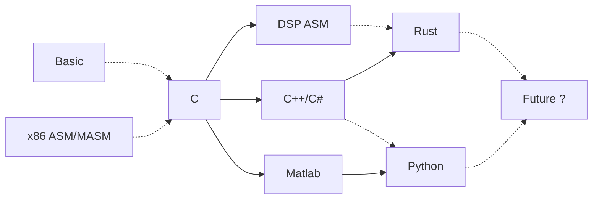
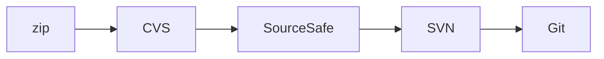
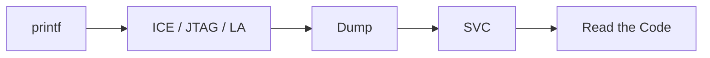

# Hi there 👋

# 🐠 Cod ⇢ Colt 🐎

**🦀 A Rust Project 🦀**  
**🖥️ A Code Farmer’s Rebirth ⌨️**  

- 🌱 Here's a code farmer's rebirth from Cod to Colt
- 🔭 Here's currently working on studying coding
- 👩‍💻 Study Rust 🦀 and run the 🦀 code step by step 👨‍💻

  <a href="https://www.youtube.com/watch?v=Ir015UtSAA0">
     ▶️ Watch Demo on YouTube 
    
  </a>

## Projects
- [**🦀 Cod2Colt**](https://github.com/cod2colt/Cod2Colt)  
Practice idiomatic **Rust** and build a gui app
- [**🎮 FlyRust**](https://github.com/cod2colt/FlyRust)  
A **game** developed in **Rust** using **egui**, following the **MVVM** architecture.

## Development Environment

## Github
  
 

## Footage

 

# 🧑‍🌾 My Profile of Coding Farmer

## **🌾 My Road as the Coding Farmer**

## **🗂️ My Struggles of Version Control**

## **🐛 My Stages of Debugging Grief**
